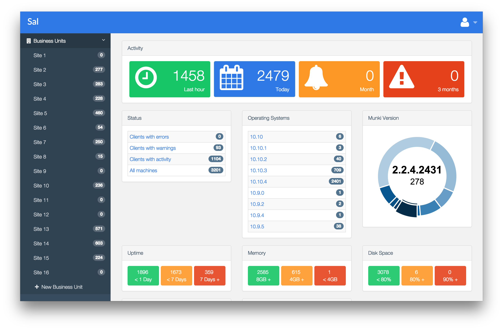
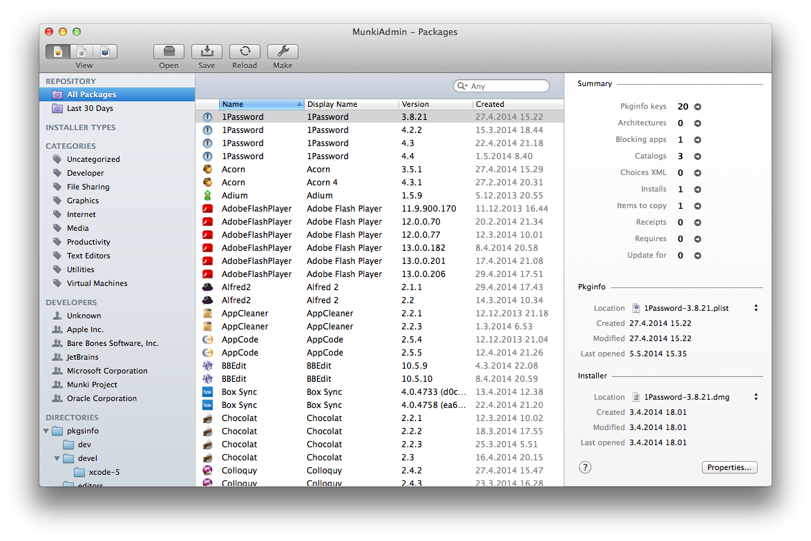
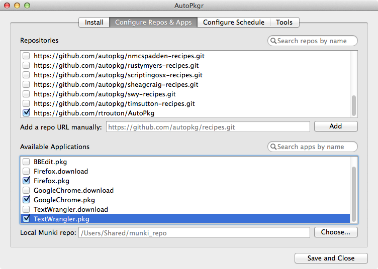
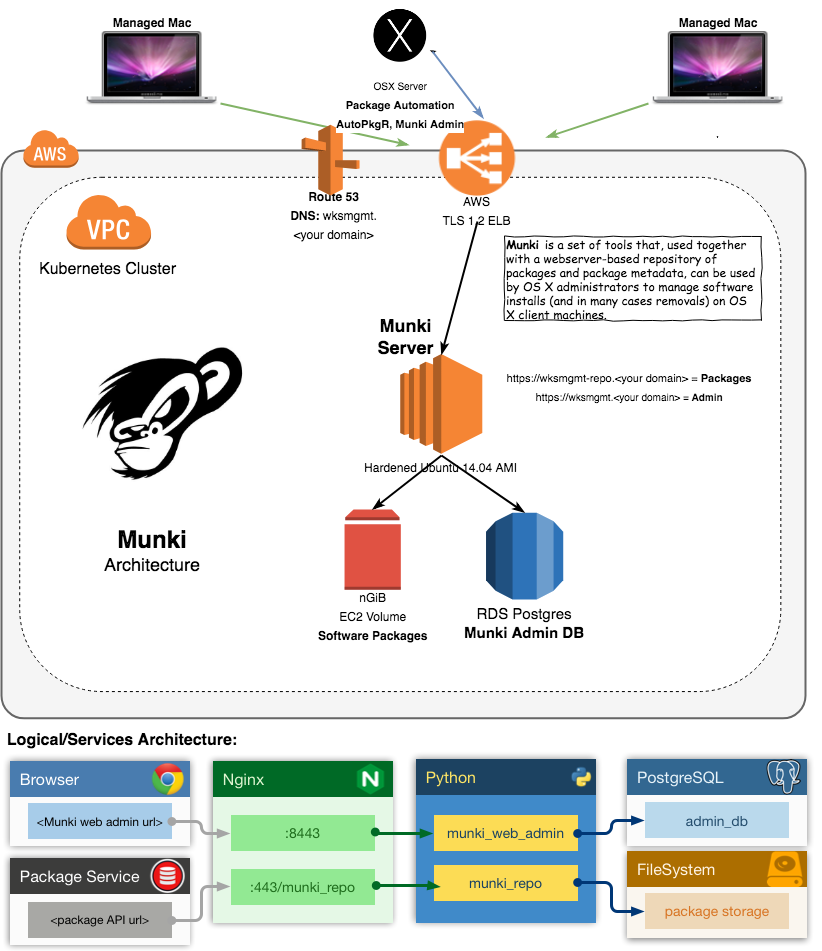

# macOS 10.n.n Fleet Management - k8s Helm Chart
#### Includes: Munki-repo, MacAdmins SAL Reporing, and embedded PostgreSQL Database .    

What's this for?
This is a solution for macOS based workstation/laptop fleet configuration and patch management           

The design is based on the guidance provided by MacAdmins [macadmins.psu.edu](http://macadmins.psu.edu/)      
and Google MacOps teams: [google/macops](https://github.com/google/macops)       
*SAL OpenSource*: [salopensource/sal](https://github.com/salopensource/sal)     
     

*Munki*: [munki](https://www.munki.org/)         
    

Remote storage: mount remote Munki pacakge site via fuse-sshfs      
*FuseSSHFS*: [libfuse/sshfs](https://github.com/libfuse/sshfs)       

Leverage AutoPackager to manage recipies:    
*autopkgr*: [lindegroup/autopkgr](https://github.com/lindegroup/autopkgr)      
    

Use MunkiAdmin to manage remote Munki Repository        
*MunkiAdmin* [hjuutilainen/munkiadmin](https://github.com/hjuutilainen/munkiadmin)       

The entire solution can be deployed on a Kubernetes Cluster:     
     
With the exception of the management tools    

*//TODO*     
- Leverage CICD & job sceduling to automate packaging

2018 gjyoung1974@gmail.com
---

